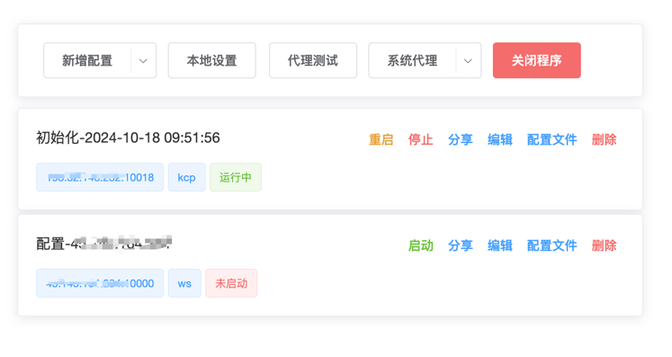

#### v2ray-panel-plus 
v2ray 自用客户端

#### 使用

`macos`: `make build-macos`

`windows`: `build-windows.bat`

*二进制直接启动即可*

#### 功能

- [x] 初始化默认配置
- [x] 设置全局系统代理
- [x] 设置自动代理 (pac模式)
- [x] vmess 导入
- [x] v2ray 功能支持 tcp/ws/kcp 协议. 
- [x] 代理测试
- [x] 多配置管理

easy to use. 