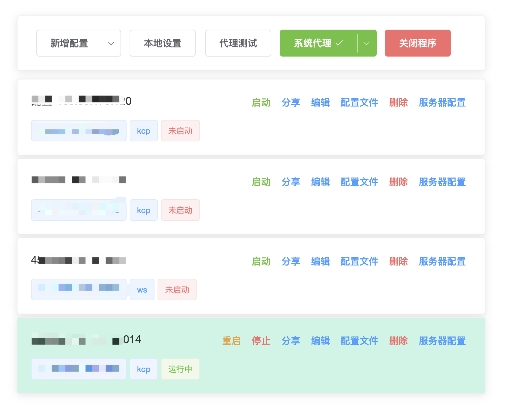
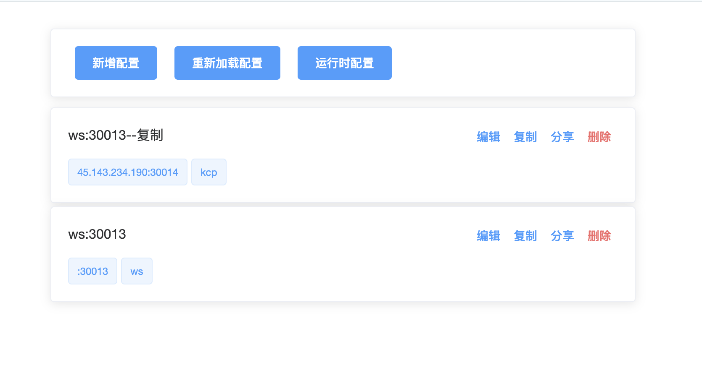

#### v2ray-panel-plus 
v2ray 自用客户端

客户端界面

客户端可以直接管理服务端的配置新增、删除、和重启
服务端界面:

#### 安装

* 客户端安装

前往 [release](https://github.com/make-money-fast/v2ray-panel-plus/releases) 界面下载最新版本的二进制文件. 

macos: M2 M4 芯片. 

windows. 暂时没有构建，有需要可以按照Makefile中的构建命令自行构建. 

* 服务器安装

前往 [release](https://github.com/make-money-fast/v2ray-panel-plus/releases) 界面下载最新版本linux的二进制文件.

#### 启动
1. 启动服务端:

后台运行:  `nohup v2ray 2>&1 &`

也可以先安装 screen, 再执行

`apt install screen` 执行: `screen` 命令进入新的窗口, 执行 `v2ray`

2. 客户端启动

后台运行: `nohup v2ray 2>&1 &`

再根据顶部菜单导航到对应的页面进行curd即可

#### 功能

- [x] 初始化默认配置
- [x] 设置全局系统代理
- [x] 设置自动代理 (pac模式)
- [x] vmess 导入/分享/二维码分享
- [x] v2ray 功能支持 tcp/ws/kcp 协议. 
- [x] 本地测试代理的连通性
- [x] 多个副本的配置管理.
- [x] 服务端的配置管理，可以新增配置、删除配置、分享不同的配置
- [x] 可以直接对服务器的配置 reload 

easy to use